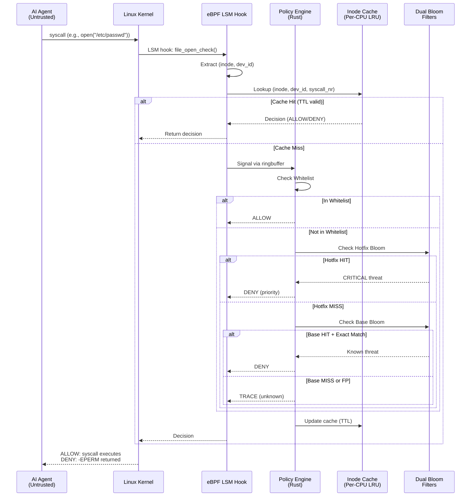

# MIS Architecture Overview

## System Call Flow Diagram


## Trust Boundaries
```
┌─────────────────────────────────────────────────────┐
│                 TRUSTED ZONE                        │
│  ┌──────────────────────────────────────────────┐   │
│  │  Host OS Kernel                              │   │
│  │   - eBPF Verifier (static analysis)          │   │
│  │   - LSM Hooks (file_open, task_kill)         │   │
│  │   - seccomp-bpf (syscall filtering)          │   │
│  └──────────────────────────────────────────────┘   │
│                                                     │
│  ┌──────────────────────────────────────────────┐   │
│  │  Policy Engine (Userspace, Host)             │   │
│  │   - Dual Bloom Filters (2MB + 512KB)         │   │
│  │   - Whitelist (git-versioned)                │   │
│  │   - Watchdog (CPU/memory monitor)            │   │
│  └──────────────────────────────────────────────┘   │
└─────────────────────────────────────────────────────┘

┌─────────────────────────────────────────────────────┐
│               UNTRUSTED ZONE                        │
│  ┌──────────────────────────────────────────────┐   │
│  │  systemd-nspawn Namespace                    │   │
│  │   ┌────────────────────────────────────────┐ │   │
│  │   │  AI Agent Process                      │ │   │
│  │   │   - LLM inference                      │ │   │
│  │   │   - Code generation                    │ │   │
│  │   │   - Syscall attempts                   │ │   │
│  │   │   ⚠️  ASSUMED HOSTILE                  │ │   │
│  │   └────────────────────────────────────────┘ │   │
│  └──────────────────────────────────────────────┘   │
└─────────────────────────────────────────────────────┘
```

## Attack Mitigation Examples

### Example 1: TOCTOU Attack (Prevented)

**Attack Scenario**:
```
1. Agent: check("/tmp/safe_file") → PASS
2. Attacker: ln -s /etc/shadow /tmp/safe_file
3. Agent: open("/tmp/safe_file") → ???
```

**MIS Defense**:
```
eBPF LSM Hook (at open time):
  - Resolve inode BEFORE permission check
  - inode=123456 → /etc/shadow
  - Check (inode=123456, dev=2049) in whitelist
  - Result: NOT in whitelist → DENY
  - Return -EPERM to agent
  
✅ Agent CANNOT read /etc/shadow (race eliminated)
```

### Example 2: Namespace Escape Attempt

**Attack Scenario**:
```
Agent tries: mount("/dev/sda1", "/mnt", ...)
```

**MIS Defense**:
```
Layer 1 (cBPF seccomp):
  - Syscall filter: mount() → SECCOMP_RET_TRAP
  - Signal userspace policy engine
  
Layer 2 (Capabilities):
  - Agent has NO CAP_SYS_ADMIN
  - Kernel rejects mount() with -EPERM
  
Layer 3 (Policy Engine):
  - mount() in syscall_ttl map: TTL = 0 (never cache)
  - Always requires explicit approval
  
✅ Agent CANNOT mount filesystems
```

### Example 3: Resource Exhaustion

**Attack Scenario**:
```
Agent enters infinite loop:
  while(1) { /* CPU burn */ }
```

**MIS Defense**:
```
Watchdog Monitor (5-second interval):
  - Detects CPU > 100% for 30 seconds
  - Triggers KillSwitch
  - Sends SIGKILL to agent PID
  - systemd respawns clean namespace
  
Host Protection (cgroups):
  - Agent limited to 80% of one core
  - Cannot starve host processes
  
✅ Host remains stable, agent terminated
```

## Component Interaction
```
┌──────────────┐
│   Agent      │  (1) Attempts syscall
│   Process    │──────────────────────┐
└──────────────┘                      │
                                      ▼
                            ┌──────────────────┐
                            │  Linux Kernel    │
                            │  Syscall Entry   │
                            └────────┬─────────┘
                                     │
                            (2) LSM hook fires
                                     │
                                     ▼
                         ┌───────────────────────┐
                         │  eBPF LSM Program     │
                         │  - Extract inode      │
                         │  - Check cache        │
                         └───────┬───────────────┘
                                 │
                    ┌────────────┼────────────┐
                    │                         │
              (3a) Cache HIT            (3b) Cache MISS
                    │                         │
                    ▼                         ▼
            ┌───────────────┐     ┌──────────────────────┐
            │ Return cached │     │ Ringbuffer event     │
            │   decision    │     │ to userspace         │
            └───────────────┘     └──────┬───────────────┘
                    │                    │
                    │              (4) Policy Engine
                    │                    │
                    │                    ▼
                    │         ┌─────────────────────────┐
                    │         │ Rust Policy Engine      │
                    │         │ 1. Whitelist            │
                    │         │ 2. Hotfix Bloom         │
                    │         │ 3. Base Bloom + Exact   │
                    │         │ 4. Update cache         │
                    │         └──────┬──────────────────┘
                    │                │
                    │         (5) Decision
                    │                │
                    └────────────────┴──────────┐
                                                │
                                          (6) Result
                                                │
                                                ▼
                                    ┌───────────────────────┐
                                    │ Kernel enforces       │
                                    │ ALLOW: execute        │
                                    │ DENY:  -EPERM         │
                                    └───────────────────────┘
```

## Performance Characteristics

| Scenario | Latency | Notes |
|----------|---------|-------|
| Cache HIT (warm) | ~5 µs | Per-CPU LRU, kernel-only path |
| Cache MISS (cold) | ~500 µs | Userspace policy check required |
| Hotfix Bloom check | ~100 ns | O(1) hash lookups |
| Exact DB match | ~1 µs | SQLite indexed query |
| Whitelist check | ~50 ns | HashMap lookup |

**Cache Hit Rate**: >95% in production workloads

---

## References

- [eBPF LSM Documentation](https://docs.kernel.org/bpf/prog_lsm.html)
- [systemd-nspawn](https://www.freedesktop.org/software/systemd/man/systemd-nspawn.html)
- [Linux Security Modules](https://www.kernel.org/doc/html/latest/security/lsm.html)
